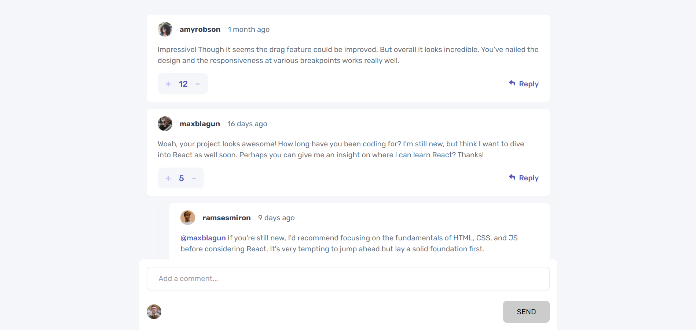

# Interactive comments section

It is one of the challenges in frontendmentor.io. The challenge is to build out this page and get it looking as close to the design as possible.

The user should be able to:

- View the optimal layout for the app depending on their device's screen size
- See hover states for all interactive elements on the page
- Create, Read, Update, and Delete comments and replies
- Upvote and downvote comments
- Keep track of when a comment or reply was made.

## Languages and Tools

- React
- Redux
- Javascript
- Scss
- Html

## Screenshot



## Installation

1. Clone the repo

```sh
git clone https://github.com/DamiGbot/interactive-comments-section-main.git
```

2. Install dependencies

```sh
npm install
```

3. Start the project

```sh
npm start
```

## Authors

- [Oluwadamilola Gbotolorun Emmanuel](https://github.com/DamiGbot)
